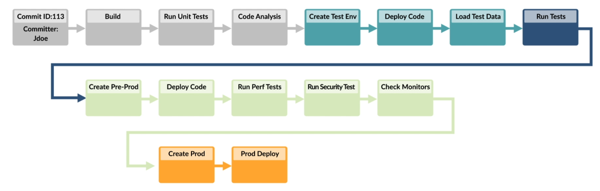
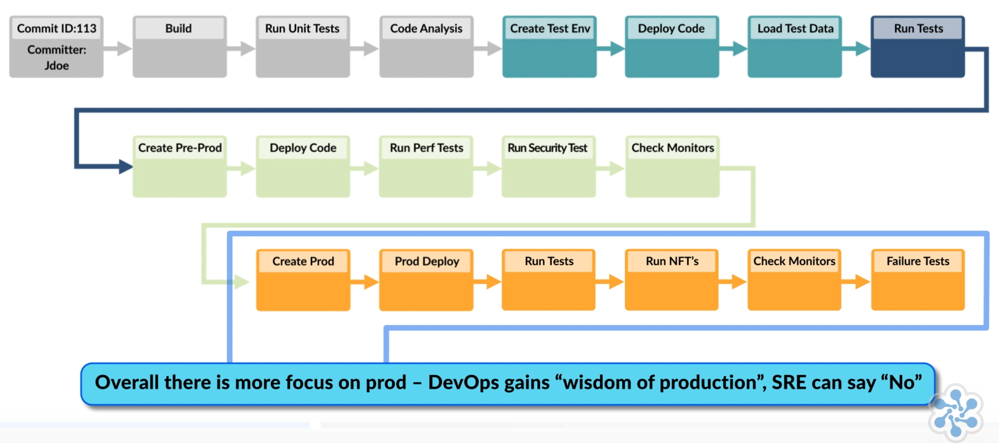
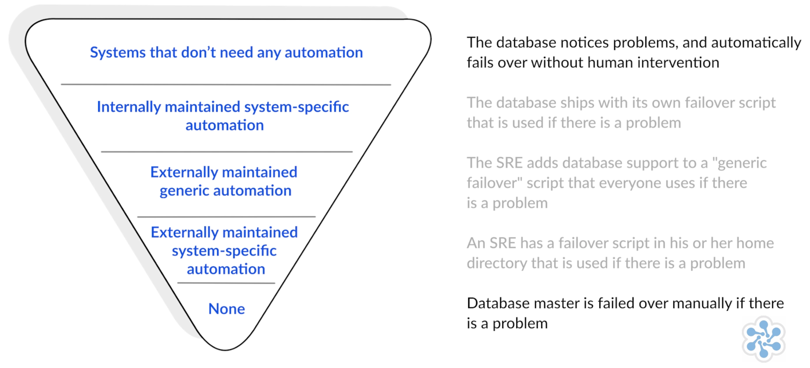
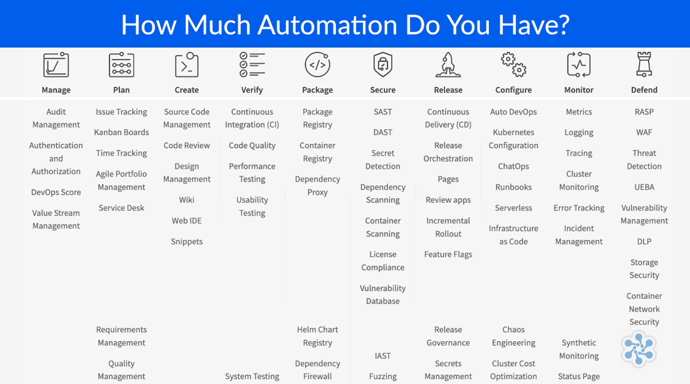

# SRE Foundation认证课程学习笔记-第二天
*** 

## 模块5:SRE工具以及自动化
* 自动化的定义
* 自动化的关注点
* 自动化的类型结构
* 安全自动化
* 自动化工具

### 5.1自动化的定义
#### 5.1.1自动化能带给我们什么
* 一致性--机器会比人更加一致
* 建立，重复使用和扩展的平台
* 更快的动作,更快的解决方案
* 节约时间
> 对于SRE而言，自动化是力量倍增器，而不是万能药 --Nial Murphy, Google SRE

#### 5.1.2自动化的前提是需要
* 解决一个问题
    * 消除琐事
    * 改善SLO
* 合适的工具
* 工程团队的支持
* 可衡量的输出

#### 5.1.3自动化的专注点
##### 5.1.3.1典型的DevOps 交付流程

从图中我们可以看到:
* 典型的Devops 自动化交付流是"Dev"领导的从左往右的,其主要特点是重开发轻运维
* 功能持续不断的推向支持生产的人员
* 开发假设测试环境和生产环境是一致的==>**作者补充:实际上生产环境比开发环境要复杂的多**
* 测试总会带来错误的自信心,因为生产环境和测试环境是不一样的
* 监控和告警总是关注已经发生过的问题

##### 5.1.3.2 关注点转变: SRE领导的服务自动化
* A. 自动化交付流由"Ops"来领导,来保证可靠性工程的优先级
* B. 环境必须置备为基础架构即代码或者配置即代码
* C. 通过类似Gitlab,Azure Devops, Bitbucket等提供统一的代码库
* D. 在生产环境执行自动化的功能测试以及非功能测试
* E. 版本化以及签名化的制品来部署系统组件
* F. 提供适当的工具以使服务在外部可见
* G. 考虑未来增长的大概轮廓
* H. 明确的抗脆弱性策略

###### B. 环境必须置备为基础架构即代码或者配置即代码
> Infrastructure as code(Iac)基础架构即代码就是您提交的代码与应用程序代码相同，并且相同的代码用于重新创建所有环境-开发，测试，预生产，生产

> Configuration as code(Cac)配置即代码就是通过代码来控制应用配置的情况,您将应用程序配置资源视为版本化的工件。 通过与应用程序代码一起管理应用程序环境，您可以获得与代码管理相同的收益。 CaC是一套流程和实践，可以节省您的时间，提高灵活性并改善系统正常运行时间。

###### C. 通过类似Gitlab,Azure Devops, Bitbucket等提供统一的代码库
||组件|工具示例|
|--|--|--|
|基础架构即代码|服务器,网络,存储|Terraform, AWS CloudFormation, Azure Resource Manager|
|配置即代码|软件,依赖项,容器|Puppet, Chef, Ansible, Saltstack, Docker, GCP Deployment Manager|

###### D. 在生产环境执行自动化的功能测试以及非功能测试
||测试|工具示例|
|--|--|--|
|扩展建造流|自动化功能项|Selenium, Cucumber, Jasmine, Mocha, Zephyr, Mockito|
|扩展测试流|自动化非功能项|JMeter, Sonatype Nexus Lifecycle, SoapUI, WhiteSource, Veracode, Nagios|

###### E. 版本化以及签名化的制品来部署系统组件
所有的服务组件,库以及依赖项(或者容器)存储在一个制品仓库中.
|制品|如何|示例工具|
|--|--|--|
|数字化版本|使用语义版本控制x,y,z|Nexus, Artifactory|
|数字化签名|为了安全和可审计|Nexus, Artifactory|

###### F. 提供适当的工具以使服务在外部可见
|考虑点|什么|示例工具|
|--|--|--|
|服务级别指标|理解和公布|OpsGenie|
|仪器|提供额外的数据和分析|Nagios, Dynatrace, AppDynamics, Prometheus|
|日志文件|合计以及准备被访问|Splunk, LogStash|

###### G. 考虑未来增长的大概轮廓
|考虑点|什么|示例工具|
|--|--|--|
|自动扩缩容|在线|Amazon Cloud AutoScaling, Kubernetes Pod Scaling|
|行政活动|自动化|定制工具云API|
|数据库|可扩展的|Amazon Cloud RDS, NoSQL-type databases like MongoDB, Couchbase|

###### H. 现在和未来规划估计(抗脆弱性)
|考虑点|什么|示例工具|
|--|--|--|
|灾难复原|测试完成|演习|
|混沌工程|实践|混沌猴子|
|值班制度|在线|PagerDuty, VictorOps, Squadcast|

**总结: SRE更加关注生产环境,并且对于devops所说的"生产环境的智慧",SRE可以说"No".**

#### 5.1.4 自动化类型的层次结构
自动化不应该只是自动化服务，配置，部署等，而是SRE要求个人像软件工程师一样从事与运维相关的事情。现在简要讨论一下自动化类型的概念和对它们进行排名的层次结构.

有趣的是，可以认为自动化以不同的形式存在，不仅如此，而且这里有自动化类型的层次结构。从底部开始向上移动，我们发现随着逐步升级层次结构，自动化逐渐成熟。例如，考虑一个需要管理和维护的数据库。在最底层，我们发现可以手动解决数据库故障。在层次结构的最高端，我们发现自动化是以数据库的形式展示的，该数据库具有自我意识，可以解决自己的内部问题并自动执行故障转移，而无需人工干预。

#### 5.1.5 安全自动化
##### 5.1.5.1 安全自动化
自动化去除了人为出错(蓄意破坏)的可能性并且提供了安全的机会.
* 我们可以在交付流中安全自动化的步骤-在手动操作中我们没法做到这一点
* 我们可以验证以在交付流中生成以及使用的制品,并进行合规性检查
* DevSecOps 将安全性引入了构建-测试-部署生命周期
* SRE 更加重视生产安全

##### 5.1.5.2 安全构建
* 应用,基础架构以及配置代码的变更通过代码分析工具来检查安全问题
* 数字签名构建的制品可以避免遇到"假代码"的可能性
* 通过访问控制来加强代码仓库的安全
* 通过社区反馈在开放的（'open source'）中完成编码

##### 5.1.5.3 安全测试
* 当基础结构或配置发生更改时，测试环境不会发生变化，它们是“不可变的”并已创建，从而保证了与代码仓库的一致性
* 我们将工程师安全构建的制品部署到测试环境中
* 创建用于测试安全性的测试数据和测试方案

##### 5.1.5.4 安全准生产
* 准生产环境也是不变的
* 在准生产环境下部署相同的制品
* 将类似于生产的数据引入到准生产环境中引入了数据安全性注意事项,例如:GDPR,PCI
* 专门的安全扫描将尝试发现安全漏洞
* 依赖项和与其他服务的集成可能会引入漏洞或代理安全性要求

##### 5.1.5.5 安全生产
* 生产环境也是不变的
* 相同的制品被部署到生产环境中
* 生产数据需要数据安全合规,例如:GDPR,PCI,SOX
* 需要证明合规性
* 失败测试可以帮助合规审计

#### 5.1.6 自动化工具
* 任何关于工具的讨论会快速演变为最喜欢的技术讨论
* 工具是持续不断变化的
* 组织对于工具会有各种偏爱,有些喜欢开源的工具,有些喜欢大IT厂商
* 自主使用最合适的工具来完成工作通常最好委派给对工作最了解的人
* 工程师使用熟悉的工具会让他们更加有生产力

##### 5.1.6.1 你有多少自动化工具?

##### 5.1.6.2 自动化类型
* 管理
    * 审计管理
    使用自动化工具确保产品和服务是合适的，包括保留生成、测试和部署活动的审计日志、审核配置和用户，以及生产操作中的日志文件
    * 验证和授权
    确保适当获得产品、服务和工具的机制。例如，用户\密码的管理和双重身份验证。提供商能否使用自己的工具，如 AWS IAM.
    * Devops 分数
    一项指标，显示组织中的Devops采用率以及交付速度的相应的影响
    * 价值链管理
    在DevOps生命周期内可视化价值传递流程的能力。 Gitlab CI和jenkins扩展，Devoptics可以提供此可视化
* 规划
    * 问题追踪
    诸如Jira，Trello，CA的Agile Central和VersionOne之类的工具可用于捕获事件或积压的工作
    * 看板
    在问题跟踪的背后，相同的工具可以通过Scrum和看板工作流板代表交付流程
    * 时间追踪
    同样，问题跟踪工具还可以根据单个问题或其他工作或项目类型来跟踪时间
    * 敏捷系列项目管理
    涉及评估飞行中的项目以及拟议的未来计划，以塑造和管理对项目和全权委托工作的持续投资。 CA的Agile Central和VersionOne就是示例。
    * Service Desk
    Service Now是一个很好的平台，用于管理服务的生命周期以及内部和外部利益相关者的参与
    * 需求管理
    处理需求定义，可追溯性，层次结构和依赖性的工具。 通常还处理代码需求和需求的测试用例。
    * 质量管理
    用于处理测试用例计划，测试执行，检测跟踪（通常为积压），严重性和优先级分析的工具。 CA的Agile Central.
* 创建
    * 源代码管理
    安全存储源代码并使其在可扩展的多用户环境中可用的工具。Git和SVN是受欢迎的示例。
    * 代码审查
    可以通过Gerrit，TFS（团队基础服务），Crucible和Gitlab等工具来增强执行对等代码审查以检查质量的能力。
    * Wiki
    知识共享可以通过使用诸如Confluence之类的工具来实现，该工具可以创建内容丰富的Wiki
    * Web IDE
    具有Web客户端集成开发环境的工具。 无需使用本地开发工具即可提高开发人员的工作效率。
    * 片段
    存储和共享的代码片段，以允许围绕特定代码片段进行协作。 还允许代码片段在其他代码库中使用。 BitBucket和GitLab允许这样做。
* 验证
    * 持续集成
    > “指的是在开发环境中集成，构建和测试代码。”--Martin Fowler, Chief Scientist, ThoughtWorks
    * 代码质量
    也称为代码分析。 Sonar和CheckMarks是自动检查代码质量的七个主要方面的工具示例-注释，修补，重复，单元测试覆盖率，复杂性，潜在缺陷，语言规则。
    * 性能测试
    性能测试是确定工作负载下计算机，网络，软件程序和/或设备的速度，响应性和稳定性的过程.
    * 可用性测试
    可用性测试是一种通过与真实用户进行测试来查看其易用性的方法。 可以使用工具来跟踪用户如何使用服务，例如 具有滚动记录，眼睛检查，鼠标跟踪。
* 包
    * 包注册表
    软件包，制品及其对应的元数据的存储库。 可以存储由组织本身或第三方二进制文件生成的文件。 Artifactory和Nexus最受欢迎。
    * 容器注册表
    容器映像的安全和私有注册表。 通常允许从构建工具轻松上传和下载镜像.
    * 依赖项代理
    对于许多组织而言，希望为经常使用的上游镜像/程序包提供本地代理。 在CI/ CD的情况下，代理负责接收请求并从注册表中返回上游镜像，充当拉入式缓存。
    * Helm Charts 注册表
    Helm Charts描述了相关的Kubernetes资源。 Artifactory和Codefresh支持用于维护Helm Charts主记录的注册表。
    * 依赖项防火墙
    许多项目依赖于可能来自未知或未验证提供商的软件包，从而引入了潜在的安全漏洞。 有一些工具可以扫描依赖项，但这是在它们下载之后进行的。 这些工具可防止从一开始就下载这些漏洞。
* 安全
    * SAST
    通过查找源代码，字节代码或二进制文件，从“内到外”测试应用程序。
    * DAST
    从“从外到内”测试应用程序以检测安全漏洞。
    * IAST
    结合了SAST和DAST方法，但涉及应用程序测试，这些应用程序基于从SAST和DAST反馈的信息来更改“实时”，并即时创建新的测试用例。 Synopisis，Acunetix，Parasoft和Quotium是朝着这个方向发展的解决方案。
    * Secret 检测
    Secret检测旨在防止敏感信息（例如密码，身份验证令牌和私钥）作为存储库内容的一部分无意泄漏
    * 依赖项扫描
    用于在开发和测试应用程序时自动在依赖项中查找安全漏洞。 Synopisis，Gemnasium，Retire.js和bundler-audit是该领域的热门工具
    * 容器扫描
    在为您的应用程序构建容器镜像时，工具可以运行安全扫描，以确保在代码交付环境中没有任何已知的漏洞。 Blackduck，Synopsis，Synk，Claire和Klar就是例子。
    * 许可证合规
    诸如Blackduck和Synopsis之类的工具会执行检查以确保依赖项的许可证与您的应用程序兼容，并批准或将其列入黑名单。
    * 漏洞数据库
    旨在收集，维护和传播有关已发现的计算机安全漏洞的信息。 然后将其作为传送管道的一部分进行检查。
    * 模糊测试
    模糊测试是一种自动化的软件测试技术，涉及提供无效，意外或随机的数据作为服务的输入并监视结果。
* 发布
    * 持续发布
    > “这是一门软件开发学科，您可以在任何时候将其发布到生产中的方式来构建软件”---Martin Fowler, Chief Scientist, ThoughtWorks
    * 发布业务流程
    通常，用于检测将导致生产中潜在问题的任何更改的部署管道。 编排其他工具将确定性能，安全性或可用性问题。 诸如Jenkins和Gitlab CI之类的工具可以协调发布。
    * Pages
    用于自动创建支持网页作为CI/CD管道的一部分。
    * 审查应用程序
    允许实时提交和启动代码。加快了环境的发展速度，以允许开发人员查看其应用程序。 Gitlab CI具有此功能。
    * 增量部署
    增量部署意味着将许多小的，渐进的更改部署到服务上，而不是部署一些大的更改。然后，将用户逐步转移到该服务的新版本，直到最终所有用户转移为止。有时被有色环境（例如蓝/绿部署）所指。
    * 金丝雀部署
    与增量部署类似，它是一小部分用户群首先被更新到新版本的地方。金丝雀的这个子集，然后在煤矿中用作众所周知的金丝雀。如果出现问题，则会回滚版本，并且只有一小部分用户受到影响。
    * 功能标志
    （有时称为功能切换）是一种技术，它允许通过使用标志来确定调用哪个行为，而无需更改基础代码即可更改系统行为。这主要是一种编程实践，尽管有诸如Launch Darkly之类的工具可以帮助进行标志管理和调用。
    * 发布治理
    发布治理与控制和自动化，安全合规性或其他方面有关，可确保以可审核和可跟踪的方式管理您的发布，以满足企业了解变化的需求。 
    * Secret 管理
    Secret管理是指用于管理数字身份验证凭据，secret（包括密码，密钥，API和令牌）的工具和方法，这些数字和凭据可在应用程序，服务，特权帐户和IT生态系统的其他敏感部分中使用。
* 配置
    * 自动DevOps 
    Auto DevOps通过自动配置软件开发生命周期，将DevOps最佳实践带入您的项目。它会自动检测，构建，测试，部署和监视应用程序。 Gitlab和AWS Code Pipelines是很好的例子。 
    * ChatOps
    能够直接从聊天，构建，部署，测试，事件管理，回滚等执行常见的DevOps事务，并将结果输出发送回ChatOps通道。
    * Runbooks
    服务顺利运行所必需的程序的集合。本质上以前是手动的，现在通常使用诸如Ansible之类的工具将其自动化。
    * 无服务器
    不需要底层基础结构或依赖项的代码执行范例。此外，一段代码是由服务提供商（通常是云）执行的，后者接管了执行环境的创建。 AWS中的Lambda函数和Microsoft的Azure函数就是很好的例子。
* 监控
    * 指标
    收集和显示已部署应用程序的性能指标的工具，例如Prometheus。
    * 日志
    捕获，汇总和存储与系统性能相关的所有日志，包括但不限于流程调用，事件，用户数据，响应，错误和状态信号。 Logstash和Nagios是受欢迎的示例
    * 追踪
    跟踪提供对已部署应用程序的性能和运行状况的洞察力，跟踪处理给定请求的每个功能或微服务。
    * 集群监控
    可让您了解在集群中运行的已部署环境的运行状况的工具，例如Kubernetes。
    * 错误跟踪
    轻松发现和显示应用程序可能正在生成的错误以及相关数据的工具。
    * 事件管理
    涉及捕获服务事件的人员，事件，时间以及继续使用此数据以确保达到服务水平目标。
    * 综合监测。通过创建脚本来模拟客户或最终用户采取的行动或路径以及相关结果来监视服务行为的能力。
    * 状态页面
    服务页面，可以轻松地将服务状态传达给客户和最终用户。
* 防守 
    * RASP，运行时应用程序自我保护。
    在可以利用漏洞之前主动监视和阻止生产环境中的威胁的工具。 
    * WAF
    Web应用程序防火墙。用于检查发送到应用程序的流量并可以阻止任何恶意软件的工具。
    * 威胁检测
    是指检测，报告和支持对攻击做出响应的能力。 入侵检测系统和拒绝服务系统允许某种程度的威胁检测和预防。 
    * UEBA
    用户和实体行为分析是一种机器学习技术，用于分析正常和异常的用户行为，以防止后者。 
    * 漏洞管理
    旨在确保先扫描资产和应用程序的漏洞，然后再进行后续过程以记录，管理和缓解这些漏洞。 
    * DLP
    数据丢失保护。 防止从服务环境或组织中删除文件和内容的工具。
    * 存储安全性
    安全的一个特殊领域，与保护数据存储系统和生态系统以及这些系统上的数据有关。 
    * 容器网络的安全性
    用于证明可以在容器集群上与任何其他应用程序一起运行的任何应用程序可以确信，没有其他应用程序的意外使用或它们之间没有任何意外的网络流量。 
最后需要注意的是，自动化本身并不是目的，而是实现目的的一种手段。 此外，自动化需要进行适当的管理，并且像服务本身一样具有生命周期。

### 模块6:抗脆弱性和从失败中学习
抗脆弱性就是要了解问题并充分利用它。 从失败中学习可以帮助您理解为什么会损坏，如何修复它们以及防止或最小化同一件事再发生。
考虑以下问题。失败是一件坏事，但是这是对谁来说呢？大多数组织/公司将失败视为一件坏事，要不惜一切代价避免这些事情，并且涉及到对相关人员的影响，从而形成一种害怕失败的文化。相反，那些相同的组织经常提倡“大爆炸”大型风险部署，这种部署具有很多风险和不确定性，这种部署通常会导致失败。

暂时暂停一下，然后考虑一下您所在的组织/公司。你所在的集体是如何看待失败的？考虑到这一点，为了使您的组织更能容忍失败，将其视为学习的机会将需要做什么。最后，为了使您的组织更安全地发生故障并避免生产中的大规模灾难性故障，将发生什么情况？正如生命教练托尼·罗宾斯（Tony Robbins）所说：“没有失败。只有结果。现在是时候停止殴打自己，开始意识到所做的一切都是成功或学习经验。”

#### 6.1 为什么要从失败中学习?
> "失败发生，你没有办法绕过它，所以停止指指点点。接受失败将有助于改进 MTTD 和 MTTR 指标。主动解决故障导致系统更加健壮--Jennifer Petoff, Global Program Manager for SRE Education, Google"

#### 6.2 通过抗脆弱性来改善指标
* MTTD - 平均检测时间(失败/事件)
    * 通过引入故障，我们优化了监控，从而更有可能检测真实事件
* MTTR - 平均恢复时间(组件)
    * 通过模拟组件失败允许我们创建自动化尝试自动修复
    * 我们也会构建更多的弹性来防止单个组件的失败
* MTRS - 平均恢复时间(服务)
    * 混沌工程方法可以识别出服务内部的关键接口以及依赖项从而知道哪里需要更多的弹性
* 服务级别目标(SLO)
    * 灾难演习例如数据库宕机可能会导致SLO没有达标
    * 缓存数据以防止数据库宕机的情况可以使得SLO达标
* 恢复点目标(RPO)
    * 在 RPO 之外引入故障（例如消息队列可能表示数据丢失过多）
    * 更高频的消息数据的备份可以满足RPO的需要

#### 6.3 改变组织
* 创造一个从失败学习的文化
“您要么是一个学习型组织，要么就输给了某个学习型组织……”，这意味着，如果您的组织没有从失败中学习，那么其他人可能就会从失败中学习，他们将变得更加稳定和有韧性，并会说服 您的客户跳船。 创建一种从失败中学习成为一种常态的文化，确实会帮助您的组织蓬勃发展，而不是令人窒息。

为了实现文化变革，领导层需要加入并给予支持。 文化变革总是艰难的，但这往往是生与死之间的区别。 从对失败的恐惧转向对失败的投资，需要在整个交付范围内进行改变。 为了帮助您的旅程，请考虑以下四个方面。 首先是要了解持续学习的原理。

如果您以前已经阅读过“The Phoenix Project”或“The DevOps Handbook”，那么您已经熟悉DevOps的三种方式框架。第一种方式讨论流程原理。 第二种方式谈论反馈的原理，第三种方式谈论持续学习的原理。 如前所述，第三种方式鼓励一种文化，该文化培养了两件事：一是不断进行实验，冒险和从失败中学习。 第二，了解重复和练习是精通的前提。
* 改变平衡
    * 第1方面 - 启用"三种方式"的第三个
    > 了解持续学习的原理,并鼓励一种文化，该文化培养了两件事：一是不断进行实验，冒险和从失败中学习。 第二，了解重复和练习是精通的前提。
    * 第2方面 - 基准"Westrum 模型"
    > 介绍Westrum模型，Ron Westrum博士进行的一项研究表明了文化如何影响表演。Westrum的研究着眼于组织如何应对问题和机遇。 所描述的病理，官僚和产生的类型是由组织领导者的思想所决定的。 换句话说，团队领导者通过创建奖励某些行为的激励结构来塑造组织文化。

所有组织有以下三种表现形式:
|病态(权利导向)|官僚(规则导向)|正常(能力导向)|
|--|--|--|
|信息是被隐藏的|信息是被忽略的|信息能被积极的看见|
|消息很"短"|消息是被隔离的|消息是被培训过的|
|逃避责任|责任隔离|责任共享|
|跨部门协作是不允许的|跨部门协作是可以的,但是不鼓励|鼓励跨部门协作|
|问题被隐藏了|组织是公正和仁慈的|问题会导致问询|
|粉碎创新|创新制造麻烦|鼓励并应用创新|

    > 在SRE的背景下，我们可以用来创建和维护高度信任的文化的技术包括：一，鼓励和创建跨越边界的团队。 第二，让质量可用性和安全性成为每个人的责任，而不仅仅是运营。 第三，在事件和中断发生时举行没有指责的事后调查，以制定有效的对策并创造学习机会。 第四，最大程度地发挥每个人的创造力，以找到新颖的问题解决方案
* 第3方面 - 引入"火警演习"
    > 消防演习建立在业务连续性计划，BCP和灾难恢复，DR的概念之上，而这些概念已经在实践中使用了数十年。 消防演习的重点是逐步弄清发生错误的情况，检查和测试技术性和非技术性的事物。 消防演习用于确保企业能够在不可预见的事件或自然灾害或紧急事件（通常是审计要求）失败期间继续运营。
    例如，许多组织进行年度数据中心故障转移测试。 以下列表提供了有关防火演习的更多示例：一个，设施丢失，数据中心或云区域。 第二，技术损失，例如数据库崩溃。 三，资源损失，团队的关键成员离职。 第四，失去重要的第三方供应商，也许一家企业倒闭或被收购并解散。 同样，请注意最后两个示例，它们并非示例。
* 第4方面 - "混沌工程"下一步
    > 混沌工程（最初是由Netflix率先提出的术语）不只是进行消防演习，而且被正式定义为工程实践。混沌工程学是在生产中的软件系统上进行实验的学科，目的是建立对系统抵御动荡和意外状况的能力的信心。 Netflix是反脆弱性运动的先驱之一，它生产了非常流行的Simian Army工具套件。该工具套件可用于测试AWS主机基础设施的可靠性，安全性或弹性，其中包括Chaos Monkey，该工具可随机禁用生产实例。 Latency Gorilla模拟网络延迟，而Chaos Gorilla模拟拆除亚马逊数据中心AZ。
    如果您是混沌工程的新手，并且想知道如何入门，请考虑采用以下步骤：
    首先，将系统隔离到关键组件中。两个测试系统没有可用的关键组件。
    首先要在非产品环境中破坏系统。
    四，介绍产品中关键部件的失效。
    五，在产品中介绍数据库故障。
    六，介绍整个系统的故障。
    此外，请考虑以下内容以突出显示混沌工程的重点领域：
    一，研究整体测井。例如，什么使整个服务正常运行？
    二，确定依赖关系。
    三，通过错误处理和恢复进行改进，
    四，从实际故障中学习。混沌工程还可以帮助我们最小化所谓的爆炸半径。任何中断都应尽可能少地影响生态系统。故障测试显示该半径的当前跨度。
    当您执行混沌工程时，真正要做的就是让您考虑并设计自动恢复。
    设计自动恢复时要考虑的事情是：
    第一，使用基础结构作为代码创建不可变的基础结构。
    第二，通过自动化测试涵盖所有系统状态和功能代码。
    第三，部署整体日志记录和监视系统以使服务可见。
    第四，实施智能警报，触发器和规范分析。
    第五，创建自我修复的基础架构和/或应用程序。
    第六, 测试然后再次测试，冲洗并连续重复。

就其本身的性质而言，某些工具和平台具有内置的自我修复机制，应加以利用。 考虑使用诸如Kubernetes和AWS Auto-Scaling之类的工具，它们可以：检测服务器或容器的受损实例并回收它们，将基础架构维护在定义的级别，根据需求自动扩展基础架构和/或应用程序，即时执行维护命令以实现以下目的： 例如，在查询运行缓慢时重新索引数据库，并将其直接集成到监视服务中。

抗脆弱性就是要理解障碍，并利用它来发挥自己的优势，使其更具韧性。 在运行大型分布式系统时，了解可能发生的潜在故障可以帮助您设计并使这些系统更加健壮和灵活。

### 模块7:SRE对组织的影响
#### 为什么组织应该采用SRE。
通常，他们这样做是为了建立站点可靠性并提高敏捷性以进行经济扩展。组织采用SRE来提高服务弹性。如今，任何人和所有人都可以了解您的服务是否以及何时中断。检测器等平台一直在运行。发生故障时，无处藏身。

随着越来越多的人在线开展业务，任何中断的影响和暴露程度都会增加。社交媒体可以在短短几分钟之内就使断电迅速蔓延，这可能导致不可逆转的声誉和品牌受损，最终影响业务绩效和利润。组织采用SRE来最大程度地减少收入损失。根据Gartner的数据，平均服务中断时间为每分钟5600美元。由于业务运作方式差异很大，因此低端的停机时间每小时最高可达14万美元，平均每小时高达30万美元，而高端则高达每小时540,000美元。

服务的停机几乎总是导致某种形式的商业损失，但也可能会有其他更明显的影响。例如，如果福利或退休金服务下线，那么依赖该服务的人将遇到基本的生活问题。离线也会导致施加经济处罚。一些组织仅仅因为它很酷就接受了SRE。像一系列其他现代框架和技术一样，SRE也正在经历炒作曲线。您需要提防炒作。如果您打算采用SRE，则出于正确的理由这样做，因为您想提高业务绩效。

#### 现在让我们考虑以下问题。
是什么促使您走向SRE？您的原因应该超出技术原因。重要的是，考虑采用SRE的商业利益。采用SRE的模式。
考虑一下您组织中当前由谁提供SRE服务或功能？考虑此问题可能有助于您确定内部SRE专业知识。
谁负责正常运行时间和可用性？
谁设置SLO？
谁在设置和查看SLI？
目前如何建立DevOps？
如果有的话。谁来劳碌？
谁为自动化和工具设定方向？
最后，有人在谈论抗脆弱性吗？

#### 典型的SRE采用选项可以总结如下：
咨询。许多组织开始采用咨询模型作为采用SRE的方法。他们与专家签约，为服务交付团队提供指导和建议。通常，此交付过程不涉及任何实际操作，因此没有共同的责任。顾问通常不会随叫随到。

嵌入式的。嵌入式模型包括让SRE专家更多地参与服务交付团队的实际工作，在SRE上共同合作以及经常进行开发活动。然后，知识转移传递给团队，并且对可靠性负有共同责任。 SRE专家会进行on-call值班工作，但随着时间的流逝，每个人都会轮流提供on-call值班支持。

平台。在平台模型中，SRE团队负责运行站点服务的基础平台，云或内部部署，并通常拥有为SRE自动化提供有动力的工具堆栈。在平台上，服务通常必须标准化工具。 SRE团队拥有生产平台，有时还拥有其他预生产环境，并经常提供第一级支持，并随时就这些方面提供服务。 SRE团队可能会寻求在一定程度上分担责任，例如平台组件，但通常不具备足够的服务知识，无法完全承担责任。

切片和切成小方块。在此模型中，将整个服务切分为不同的部分，其中SRE拥有一些元素，而服务交付团队拥有其他元素。分片可以包括应用程序和基础结构组件，通常是整个服务的关键部分，例如付款处理。该模型类似于平台模型，但是允许SRE团队开发更深入的知识和对更广泛服务的理解，从而可以承担一些共同的责任。待命责任仍然存在。

最后，完整的SRE。进行完整的SRE涉及所有团队成员拥抱SRE做法，每个人都应on-call值班，从第一天起就承担站点可靠性的责任，并且积压了与新功能同等的可靠性。采用SRE时，设定切合实际的目标和期望很重要。并非所有的事情都是可以实现的，但是也不是。专注于什么是适当的。为采用SRE制定一个总体愿景，即组织应该走向的所谓“真正的北方”。

#### 定义SRE工作角色。 
SRE工程师通常关注的职责是什么？
考虑以下2019年11月11日发布的Google SRE招聘广告，该广告要求申请人具备以下能力：
一，参与并改善服务的整个生命周期。
二，在服务上线之前，通过系统设计咨询，开发软件平台和框架，容量规划和启动审核等活动来支持服务。
三，通过测量和监视可用性，延迟和整体系统运行状况，在服务投入使用后对其进行维护。
四，通过自动化等机制来可持续地扩展系统，并通过推动改进可靠性和速度的变化来发展系统。
五，练习可持续的事件响应和无指责的故障调查。

突发事件响应是SRE要求管理的重要组成部分，以确保最低要求。随时待命是运营和工程团队必须承担的关键职责。根据先前审核过的Google职位描述，事件响应必须是可持续的。值班要求您熟悉与服务中断有关的SLO编号。

考虑具有三个9可用性SLO的服务。这就要求将给定月份内的所有问题在43分钟内解决。请记住，这段时间包括问题识别，警报，消息传递，分类和修补或修复。您可以看到为什么为服务设置适当且切合实际的SLO如此重要的原因。考虑以下。 SRE应该多久拨打一次电话？ Google提倡25％的通话率规则和50％的琐事限制规则。

示例性SRE名册可以包括以下内容。为避免单点故障，请至少招聘两位SRE。提供持续的24*7支持通常将需要至少八个SRE。 SRE计划至少每个月有一周的通话时间。通话分散在多个地点可能意味着没有夜班。这是向阳规则。

#### 考虑以下最佳实践清单。
一，分配个人。围绕待命人员提供组织清晰度。
二，合适的设备。提供一种用于接收所有相关信息的机制。
三，警报传递系统。捕获并提供正确的信息以及任何背景信息。
四，文件记载的程序。最小化通话响应活动的风险。
五，无指责的故障调查。确保不会重复出现相同的问题。

为了有效地执行沟通，这些是组织必须具备的东西。最小化风险非常重要，因为SRE通常在不合时宜的时间被调用，而且可能不会考虑清楚。备有文档化的恢复过程，使修复过程变得更加容易。何时何地使用自动化来代替呼叫中的呼出。自我修复服务使我们摆脱了传统的操作员维修服务。

Kubernetes和AWS自动扩展组之类的工具提供了开箱即用的自我修复功能。自动化避免了被调出的操作员判断力受损的问题。并且可以在无指责的故障调查中回顾自我修复的动作。现在，让我们更深入地探讨无指责的故障调查的概念。以下引用明确指出了预期会发生故障的概念。 “因此，会发生故障。这在使用复杂系统时已成定局。”

#### 无指责事后故障调查
组织可以并且确实尝试通过测试，监视和自动化来防止故障并将故障最小化，但是事情仍然会失败。当故障发生时，不要否认这一点，也不要责怪个人。相反，请查看导致失败的事件，并尝试找出发生的一切，而不必去怪罪相关人员。这是无指责故障调查概念的核心。

##### 基本规则
应制定基本规则，以决定何时需要进行故障调查。并非每个警报或中断都需要一个警报或中断，尤其是在用户影响很小或影响很小的情况下。但是，当以下任何一种情况发生时，应进行无指责故障调查。
一种是用户可见的停机时间或性能下降超过特定阈值的情况，例如SLO。
第二，任何形式的数据丢失。
三，随时待命的工程师干预，例如释放回滚或重新路由流量等。
第四，解决时间超出或超过某个阈值。
第五，监视失败，通常意味着手动发现事件。无指责故障调查就是建立事实。通常，有几位参与者从不同角度看待失败，并且所有观点都应被平等地捕捉。

##### 文化变革
进行无指责故障调查可能被认为是重大的文化变革，因此请强调，进行此类变革时应避免受到惩罚或报应。组织需要让员工安全谈论故障。认为自己将受到惩罚的工程师会受到激励，无法提供必要的正确信息，以使他们了解发生的故障的真实情况。

除人工输入外，还将提供自动化反馈和监视输入。日志文件和管道中的数据可以提供刚发生的情况和时间的确凿证据。高信任度的组织鼓励良好的信息流，跨职能的协作，共同的责任，从失败中学习和提出新的想法。组织应变得更加基于绩效，因此应将失败视为失败的机会，以此作为学习和改进的机会。从敏捷中借用以下引文，强调了在SCRUM回顾期间进行公开，诚实讨论的前提。

##### 关键项目反馈循环。
此项也可以在任何无指责事后故障调查开始时使用。建立安全性意味着人们可以在生产环境中做更多的事情，而不必担心受到打击。为了安全起见，工程师在出现问题时也必须承担责任。如果工程师引发了事故，那么重点就不应该放在责备和惩罚上，而是要让工程师对他们的行为负责，并主动减少此类事故的发生。

需要平衡DevOps对更连续交付和部署的需求，并且要理解工程师在出现问题时将对他们的问题负责。生产中工作的工程师越多，通常意味着更大的吞吐量和价值实现，但是吞吐量必须可靠。如果出问题了，那么SRE可能会接手此事，但工程师将是整个故障调查过程的关键部分。

##### 多视角看待问题
可以使用其他视角查看事件和故障。
一种观点可以是指责的，而另一种观点是无指责的。在考虑了这里介绍的两种观点之后，您会支持哪一种？无指责故障调查有输出，其中可以包括以下任何一项。
一是事件或失败的详细信息，例如摘要，影响，触发，检测，解决和/或参与者。
第二，一系列的后续行动，以减少同一事件或类似事件再次发生的未来机会。
三，从事件中学到的教训。
四，发生的事情的时间表。
五，任何支持信息。
这种信息在调查之后需要记录下来。事件发生时会生成大量此类信息，因此相关人员应捕获这些信息。

除人工输入外，还将提供自动化反馈和监视输入。日志文件和管道中的数据可以提供刚发生的情况和时间的确凿证据。考虑以下Sage Group提供的案例。该公司专注于事件管理的自动化，因此他们学会了接受预期会发生的事件，因此，尝试消除管理员的痛苦，使工程师可以将精力仅仅集中在解决问题上。

#### 工具
工具可以而且确实对此有所帮助。Sage的故事提供了一个很好的例子。 Service Now是一个流行的服务管理平台。 Slack是一个在线交流平台。 Zoom是基于Web的会议产品。 Sage已投入时间将这些工具集成在一起。还将记录任何事件期间发生的事情的完整历史，从而将其记录到事后评估过程中。

#### 如何在组织内扩展SRE。
快速提醒一下，Google并非只是为此发明了SRE。相反，他们这样做是为了解决一个实际问题，即您如何在大规模分布式系统环境中处理问题，并能够处理服务，用户，地域和通过它发送的请求数量的增长，而这一切全都在脑海中进行。在您自己的组织内推广SRE的实践和原则可能会遇到挑战，但是，某些关键的成功因素将对您有所帮助。

一是获得执行官级别的支持和支持。
二，分配资金和预算来管理团队。
三，跨交付领域的良好关系：工程师，测试，基础架构等。
四，一个正在成长的组织。
前两项适用于任何类型的组织变更。必须有非常高层的支持和赞助。 SRE涉及共享所有权和共享责任的概念。在SRE和其他团队之间建立牢固的关系非常重要。

对于用户数量或交易数量而言，SRE对于正在增长的组织也至关重要。一个没有成长的组织将不会面对SRE试图解决的各种挑战。这就是为什么我们谈论在组织内部扩展SRE的原因。组织可以经历不同维度的增长。例如，请考虑以下内容。
平台增长。
大量的用户，不规则的数据流以及传统到现代的体系结构。
范围增长。新产品和/或服务。
工单增长。事件，中断，请求和/或工作量。

SRE通常需要扩展，因为组织会跨一个或多个维度进行更改。 “通过工程解决方案，SRE使组织能够以比其组织规模更大的速度扩展其服务。” Google提供的这句话强调了一个事实，即随着服务的增长，我们需要使用更好的工程方法来支持这种增长。随着客户数量的增长，工程解决方案可以帮助我们扩展服务，而无需扩展组织本身。

#### 哪些SRE方法可用于扩大平台增长？
为了回答这个问题，我们提供了几种自动化功能，可以单独使用或结合使用以安全地应对平台增长，例如：
一，自动化技术，例如自动扩展，容器化和/或群集化。
二，灵活的平台，例如公共云和私有云。
三, 非结构化NoSQL之类的数据库，例如MongoDB。
四, 围绕构建，部署，测试和监视即服务功能。

#### 服务业务范围增长可以通过以下方式处理。 
SRE拥有通用工具和平台。其他开发使用的平台SRE模型。 
SRE的专业知识向左转移到开发团队中，即所谓的嵌入式SRE模型。
自动化的工作使更多的SRE时间可用于开发。
工单增长可以通过自动化技术来处理。

正如我们在琐事章节所看到的，处理工单通常被认为是琐事：低价值的重复性物品。自动完成处理工单是SRE概念中的关键要素。

### 模块8:SRE,其他框架,趋势
SRE适用于运行服务和生产的任何人。 
SRE主要补充已经采用的其他现有框架，方法和/或交付方法。如果您已经在使用其他框架，那么好消息是SRE将补充这些框架。同样，SRE的最佳选择是运行大型服务和生产并希望可靠地进行大规模生产的组织。

在考虑SRE所扮演的角色时，将其与现有框架一起考虑是很有用的，即使只是承认它如何可以互补。考虑以下。通过敏捷交付来统一业务。 DevOps提倡持续交付和持续部署等机制，以提高速度和流量。 SRE在稳定性和可靠性方面提供了广泛的业务重点。 ITSM在整个价值流中建立组织学习。

选择SRE不需要您放弃或换掉其他框架。实际上，SRE可以而且经常与其他框架进行交互，并且可以高度互补。在这里暂停并简要思考以下问题。敏捷如何告知我们在SRE中的工作？这里的目的是考虑敏捷对您的组织意味着什么，以及它是否对SRE重叠或影响，反之亦然。这里没有对与错的答案。

接下来，让我们考虑一下SRE如何与其他框架一起使用，例如敏捷，DevOps和ITSM。在这里，我们可以看到SRE团队可以通过使用Scrum和Kanban之类的框架以敏捷的方式行事。琐事的积压使工作可见，并且可以优先考虑自动化。仪器确保协调，可见性和优先级。完成的定义是更注重生产，并通过工作软件交付价值。

SRE和DevOps齐头并进。从某种意义上说，SRE是DevOps的一种专业化，它可以进一步分解组织孤岛，交付管道更进一步，DevOps指标和措施得到进一步改善，自动化更加广泛和一致。 VictorOps提出的以下案例故事指出：“像DevOps一样，网站可靠性工程没有一种千篇一律的方法。对于像Google或Facebook这样的公司有效的方法对我们来说没有意义。有效的SRE并非如此只是在事件发生时快速响应事件，而在构建基础架构时进行适当的测试并提高系统的可用性。”

在这里，关键要点是SRE实际上是DevOps文化和学科的关键组成部分。一起考虑SRE和ITSM。 SRE可以通过自动化和工程技术协助ITSM合规性活动。与SRE一样，ITIL流程也以自动化为基础，尤其是在操作流程的过渡过程中，这是连续测试和交付的一部分。在SRE中，失败是一个学习的机会，在ITSM中嵌入了持续学习。

ITIL为变更，配置，发布，事件和问题管理以及SRE涉及的所有领域等流程提供指导和结构。 ITSM流程模型支持SRE。在整个ITIL中都使用模型，例如事件管理，问题管理和/或请求实现。为不同的管道创建模型还可以帮助您了解每个管道所需的治理，风险和合规性级别。实际上，SRE的工程心跳使许多手动服务管理流程自动化，特别是服务转换，服务运营和服务改进。

工程方法还可以提供合规性证据。 SRE不需要独立。没有一个框架需要排他性地选择另一个框架，而SRE确实也是如此。实际上，所有框架都有其自身的优缺点和目的。

总体而言，我们正在努力实现跨组织的无缝且高效的服务交付流程，以提供稳定，可靠的服务，从而为利益相关者带来价值。敏捷，DevOps，SRE和ITIL都是为此做出的贡献。 SRE是交付系统的一部分。

不同的实现以不同的方式影响价值流。无论如何，所有方法都是从左到右。他们将为用户提供更多。 SRE的独特之处在于它从右到左流动，而不是从左到右流动，充分利用了生产的智慧，并将其返还给改善思想，计划，设计，建造，部署，测试发布以及减少操作或减少琐事。

现在让我们继续讨论SRE的发展。但是在我们这样做之前，请考虑以下问题。
您认为未来会影响SRE的哪些挑战？考虑当前影响您的业务的因素以及它们将对生产产生的进一步影响，并最终考虑站点可靠性工程将扮演什么角色。
要考虑的一些想法可能是：
一，我们正在增加数字渠道，
二，我们将全部集成在云中的云混合系统中，
三，我们所有的未来应用程序将首先在移动设备上使用。
四, 期望通过我们的数字渠道实现显著的用户增长。

LinkedIn的一位高级可靠性工程师提供的以下意见突出了有关他们认为SRE前进方向的几件重要事情。 
> “我看到的五种新趋势是：“故障是新常态，自动化即服务，云为王，是观察，学习以及网络工程师的发展。”

现在让我们深入研究这五个新的预期趋势。
一，故障是新常态。这是我们应该从失败中学习甚至开始引入失败的想法。
二，自动化即服务。作为一种服务，我们不再需要自己安装和管理自动化工具。相反，服务提供商将向我们提供它们。例如，将CI / CD视为Amazon的一项服务。
三，云为王。使用托管服务来确保云平台提供的可靠性，例如自动缩放和自我修复，这将成为常态。
四，观察和学习，即可观察性。了解更多关于我们的服务并了解使它们变得可靠的想法。五，网络工程师的发展。

##### 网络可靠性工程师 NRE
回顾上面提到的，希望看到SRE角色专业化。例如，网络可靠性工程师或NRE的工作角色。以此身份行事，您将应用工程方法来测量和自动化网络上的可靠性。您将整理软件定义的网络，SDN，并应用SDLC原理来构建，测试和部署网络更改。您将使用混乱的工程技术来测试网络的可靠性，并监视网络服务级别指示器并创建自动和/或手动响应。

##### 数据库可靠性工程师或DBRE
扮演数据库可靠性工程师的职务，您将使用软件和工具来自动化手动数据库任务。将混乱工程应用到数据库，以确认故障转移并还原响应。转向使用托管数据库服务。例如，AWS的RDS服务。并提供创新的解决方案来应对组织数据挑战。

##### 客户可靠性工程师或CRE。
作为客户可靠性工程师的工作角色，您需要将工程思想应用到客户支持中，在供应商之间建立共同的责任，并且客户使用SRE做法来改进客户应用程序并利用自动化来减少工作量。例如，引入自动化的客户事件管理工具和/或聊天机器人。

##### 遗产可靠性工程师或HRE
扮演遗产可靠性工程师的角色，您将建立专注于传统处理的SLO。您可以将遗留物重新平台化到现代化的体系结构上，也许从大型机到英特尔，甚至到云，通过在工程上投入时间来消除麻烦，扩展遥测以提高可观察性，并运行故障测试以确保关键服务仍然可用。

最后,请考虑一下Honeycomb首席执行官关于她认为SRE工具发展方向的以下预测。 
> “我相信在未来三年中，所有这三个类别（APM，监视/指标，日志以及可能其他类别）将不复存在。只有一类：可观察性。它将包含所有见解。您需要了解系统可以进入的任何状态。”
